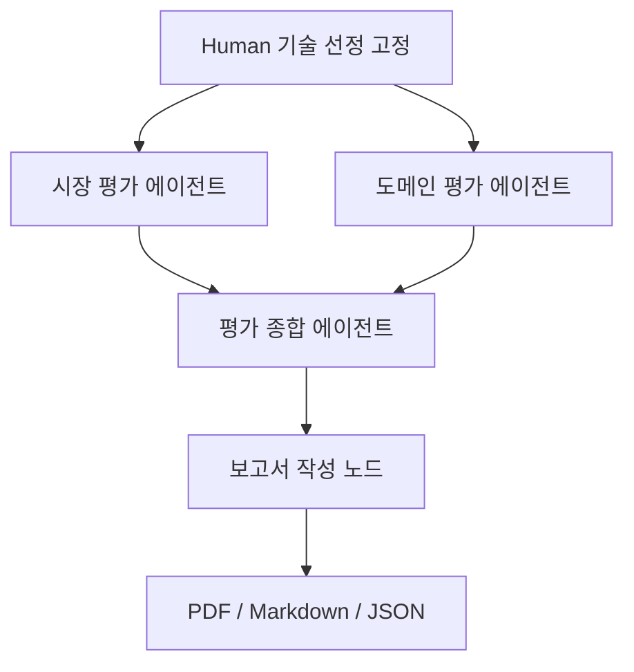

# KV cache 다관점 평가 에이전트

Human이 선정한 **DeepSeek-V2 MLA**와 **CXL-PNM (PNM-KV/PnG-KV)**를 시장성(M1~M3), AI 코딩·업무 에이전트 도메인(D1~D2)에서 평가하고 한국어 PDF·Markdown·근거 JSON을 생성합니다. 기술 성숙도와 이해관계자 평가는 포함하지 않습니다.

## 실행

Python 3.12 권장. 최초 실행은 논문·공식 문서와 무료 임베딩 모델을 다운로드하므로 인터넷이 필요합니다.

```bash
python3 -m venv .venv
source .venv/bin/activate
pip install -r requirements.lock
cp .env.example .env
# .env에 OPENAI_API_KEY를 직접 입력
python main.py --mode live
```

기본 LLM은 `gpt-4.1-mini-2025-04-14`, `OPENAI_MODEL`로 변경합니다. OpenAI Responses API의 Structured Outputs를 사용합니다. 계정별 모델 사용 가능 여부·비용은 별도이며 키·응답은 Git에 저장하지 않습니다. live 모드는 공개 원문의 검색 청크와 문서 텍스트를 OpenAI에 전달합니다.

키 없이 실행 흐름을 확인하려면:

```bash
python main.py --mode replay
python -m unittest -v
```

**replay는 LLM 평가나 실시간 웹 검색을 수행하지 않습니다.** `data/reviewed_evidence.json`의 검토 기록을 읽되 실제 오픈소스 임베딩·원문 검색·출처 검증·점수 계산·LangGraph·PDF 생성을 실행합니다. 재현 PDF에 실행 모드를 명시합니다. live 실패를 replay로 자동 대체하지 않습니다. live는 실제 모델 제안을 `evaluation.json`에 남기지만, 최종 판정과 종합 문장은 검토 원장을 기준으로 대조합니다. 원장과 다른 제안은 보고서에 자동 반영하지 않습니다.

한글 TTF가 자동 탐지되지 않으면 `.env`에 `REPORT_FONT=/절대경로/한글폰트.ttf`를 지정합니다. macOS에서는 Arial Unicode 또는 AppleGothic을 사용합니다. 폰트 파일은 저장소에 포함하지 않습니다.

## 산출물

- `output/live/report.pdf`: 실제 API 실행 평가 보고서(10페이지 초과 시 생성 실패)
- `output/replay/report.pdf`: 검토 기록 기반 재현 보고서
- `report.md`: 같은 내용의 편집 가능한 본문
- `evaluation.json`: 점수 입력·채점 결과·출처·원문 청크·검색 결과·실행 모드
- `graph.mmd`: 실제 컴파일한 LangGraph

제출 시 실제 실행 모드를 확인하고 PDF 이름을 과제 양식으로 변경하세요. GitHub public 게시·thread 제출은 자동으로 하지 않습니다. 원문은 `data/raw/`, 모델은 `.cache/`, 벡터는 `data/index/`에 보관하며 Git에서 제외합니다. 원문 청크가 포함된 `evaluation.json`도 로컬 검토용으로 Git에서 제외합니다. 검토 요약과 출처 목록은 `data/`에 포함됩니다. 설치 환경의 정확한 버전은 `requirements.lock`, 허용 버전 범위는 `requirements.txt`에 기록했습니다.

## 에이전트와 도구



| 구성 | 역할 / 도구 |
| --- | --- |
| 시장 평가 | OpenAI가 검색어 계획 → OpenAI WebSearch → M1·M2 원문 문서 확인, M3만 VectorRetriever 청크로 교차 확인 → 근거 부족 시 1회 재검색 |
| 도메인 평가 | OpenAI가 검색어 계획 → VectorRetriever + OpenAI WebSearch → 선정 논문의 비교 조건·KV·TTFT·TPOT·비용 확인 → 근거 부족 시 1회 재검색 |
| 종합 평가 | 검토된 원장을 기준으로 두 관점의 차이와 한계를 설명. 새 수치·출처·합산 순위를 추가하지 않음 |
| 보고서 작성 | 검증된 State를 정해진 목차로 렌더링. 추가 LLM 없이 코드로 PDF 생성 |

시장과 도메인은 LangGraph fan-out으로 병렬 실행하고 `market`, `domain`, 각 trace를 분리 저장합니다. 양쪽 완료 후 join하여 종합합니다. 검색 재시도는 각 기술·관점당 최대 1회입니다. OpenAI WebSearch는 추가 API 도구 비용이 발생할 수 있습니다. 웹 검색 결과는 발견용이며 단독 채점 근거로 쓰지 않습니다. 고정 문서 풀 외의 신규 자료는 `sources.json`에 검토·추가한 후 재실행해야 합니다.

## 임베딩과 문서 풀

오픈소스 `intfloat/multilingual-e5-small`을 로컬 CPU에서 사용합니다. 한국어 질의와 영어 원문을 함께 다룰 수 있고, 큰 모델보다 다운로드·CPU 부담을 낮추기 위해 선정했습니다. 후보는 영어 중심 `all-MiniLM-L6-v2`, 더 큰 다국어 `multilingual-e5-base`입니다. 이 선택은 비용·언어 지원 기준이며 검색 품질 우월성을 실험으로 증명한 것은 아닙니다.

E5 권장 `query:` / `passage:` 접두사, 정규화 임베딩, NumPy cosine 검색을 사용합니다. 토큰 기준 300개 청크·60개 겹침. 자료 규모가 작아 별도 벡터 DB가 필요하지 않습니다. PDF 실제 페이지 수와 웹 3,000자당 1페이지의 환산량 합계를 200페이지로 제한합니다. PDF 페이지와 웹 환산페이지는 trace에서 구분합니다. 원문 URL·버전·수집 시간·SHA256을 기록하며, 이미 받은 자료는 재사용합니다. 웹 문서 변경을 반영하려면 해당 raw 캐시를 삭제하고 다시 실행합니다.

## 평가 규칙과 보완한 가정

| 기준 | 계산 |
| --- | --- |
| M1 | 수요 동인·채택 확대·공급/생태계 투자 각 0~2. 0 미확인, 1 단일/간접, 2 복수/시간상 확대. 합 0~1 낮음, 2~3 보통, 4~5 높음, 6 매우 높음 |
| M2 | 채택 주체·출처가 있는 사례의 최고 L0~L4. 선정 기술과 기술 계열을 각각 계산 |
| M3 | 프레임워크·벤더 제품·표준화·제3자 연구/도구의 Y 수. 3~4 L3, 1~2 L2, 0+원저자 구현 L1, 모두 없음 L0 |
| D1 | KV 감소율을 `1/(1-r)`로 환산하거나 같은 조건의 문맥 증가 배수. 4 이상 L3, 2 이상 L2, 1 초과 L1, 이외·근거 없음 L0 |
| D2 | 비용 절감+SLA 충족하에 TTFT·TPOT의 최대 증가율: 0 이하 L3, 10% 이하 L2, 초과 L1. 절감 없음/SLA 미충족 L0. 필수 근거 미확인 시 판정 유보 |

M1 세부 항목, D1 구간 경계, D2의 판정 유보는 사용자의 정의에서 미정인 부분을 보완한 **운영 가정**입니다. L0(실패·개선 없음)와 자료 부족을 설명에서 구분합니다. 93.3% 감소의 역수는 세션 길이 실측이 아니며, 서로 다른 구성의 128K와 1M을 나누어 D1을 매기지 않습니다. 처리량을 TTFT로, KV 감소율을 전체 비용 감소율로 사용하지 않습니다.

## 보고서와 검증

첫 챕터 `SUMMARY`(반 페이지 이내 핵심 요약), 마지막 `REFERENCE`. 시장·도메인만 평가하며 특허·논문·웹 자료의 실사용 출처만 기록합니다. 미확인 발행일·학술지 정보를 만들어 넣지 않습니다. 선정 논문과 기술 계열의 근거는 분리합니다.

`python -m unittest -v`의 8개 검사는 점수 경계, 잘못된 입력, 출처 위조·범위 혼합, M3 원문 청크 누락, OpenAI 응답 형식·실패 처리, 재검색 1회 제한, 병렬 평가의 합류, 근거가 없는 상용화 주장 차단을 점검합니다. live API 실행은 유효한 키와 모델 접근 권한이 있어야 검증할 수 있습니다. LLM의 의미 해석과 사실의 정확성은 JSON 스키마만으로 보장되지 않으므로 최종 제출 전 근거를 검토해야 합니다.

공식 구현 문서: [LangGraph](https://docs.langchain.com/oss/python/langgraph/graph-api), [OpenAI Structured Outputs](https://developers.openai.com/api/docs/guides/structured-outputs), [E5 모델 카드](https://huggingface.co/intfloat/multilingual-e5-small).

## Contributors

팀원 정보 미입력. 제출 전에 실제 이름과 구현·검색·평가·검증 기여를 기록하세요. PM/PL 직함만으로 작성하지 않습니다.
