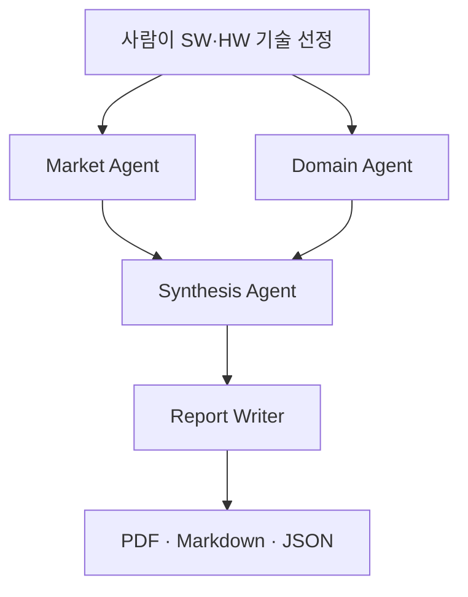

# KV Cache 다관점 평가 Agentic RAG

본 프로젝트는 KV cache 최적화 기술을 소프트웨어와 하드웨어 진영에서 하나씩 선정하고, 여러 관점의 근거를 수집·대조하여 평가하는 Agentic RAG입니다. 현재 구현은 **시장성**과 **AI 코딩·업무 에이전트 도메인 적합성**을 평가합니다. 이해관계자 관점은 향후 확장 대상이며 현재 평가·보고서에는 포함되지 않습니다.

## Overview

- **Objective:** DeepSeek-V2 MLA(SW)와 CXL-PNM(HW)을 시장·도메인 관점에서 비교 평가
- **Method:** LangGraph 기반 분산형 Multi-Agent + Agentic RAG
- **Tools:** 로컬 벡터 검색, OpenAI WebSearch, PDF 원문 추출 및 출처 검증
- **Output:** 한국어 PDF·Markdown 보고서와 평가 근거 JSON

## Selected Technologies

- **SW — DeepSeek-V2 Multi-head Latent Attention (MLA):** KV cache 저장량을 줄이는 소프트웨어 기반 접근이며, 공개 논문과 구현·생태계 자료를 함께 검토할 수 있어 선정했습니다.
- **HW — CXL-PNM (PNM-KV/PnG-KV):** CXL 메모리와 near-memory processing을 활용한 하드웨어 기반 접근으로, MLA와 다른 시스템 설계 관점에서 평가할 수 있어 선정했습니다.

두 기술의 논문 수치는 실험 환경과 기준이 달라 직접적인 우열 비교에 사용하지 않습니다. 기술 자체의 채택 사례와 관련 기술 계열의 채택 사례도 구분합니다.

## Features

- `data/papers/`의 논문 PDF와 공식 웹 문서에서 텍스트를 추출하고, 페이지·출처·SHA-256 해시를 기록합니다.
- 시장 평가 에이전트와 도메인 평가 에이전트를 병렬 실행한 뒤 결과를 종합합니다.
- 검색 계획 → 원문 검색 → 근거 평가 → 근거가 부족할 때 최대 1회 재검색의 흐름을 사용합니다.
- **확증 편향 방지:** 검색 URL이나 스니펫만으로 주장하지 않고 원문 접근성·주제 적합성·인용 출처를 확인합니다. 선정 기술과 기술 계열의 근거, 실측과 시뮬레이션 결과를 분리하며, LLM 제안은 사람이 검토한 `data/reviewed_evidence.json`과 대조합니다. 새 근거가 자동으로 최종 점수를 바꾸지는 않습니다.
- `replay` 모드로 API 키 없이 검토된 근거를 재현할 수 있습니다. 이 모드는 실시간 웹 검색이나 LLM 평가를 수행하지 않습니다.

## Tech Stack

| 구성 | 현재 구현 |
| --- | --- |
| Framework | LangGraph |
| LLM / Generator | OpenAI Responses API, 기본값 `gpt-4.1-mini-2025-04-14` (`OPENAI_MODEL`로 변경 가능) |
| LLM / Judge | 별도 Judge 모델 없음. 최종 판정은 검토된 근거 원장과 코드의 평가 규칙을 사용 |
| Retrieval | `intfloat/multilingual-e5-small` 임베딩 + NumPy cosine 검색. 별도 VectorDB 없음 |
| Retrieval metrics | Hit Rate@K, MRR은 아직 측정·공개되지 않음 |
| PDF / Report | 논문 PDF 추출, 한국어 PDF·Markdown 보고서 생성 |

검색은 `query:` / `passage:` 접두사와 정규화된 임베딩을 사용합니다. 데이터 규모가 작아 현재는 별도 벡터 DB 대신 로컬 NumPy 검색을 사용합니다.

## Agents

- **Market Agent:** 수요 동인, 채택 사례, 생태계 근거를 검색하고 시장성 M1~M3을 평가합니다.
- **Domain Agent:** 논문의 비교 조건, KV 수용성, 생성 처리량 근거를 확인하고 도메인 D1~D2를 평가합니다.
- **Synthesis Agent:** 검토된 원장을 기준으로 관점별 결과와 한계를 종합합니다.
- **Report Writer:** 검증된 상태를 PDF·Markdown·JSON 산출물로 정리합니다. 별도 LLM을 호출하지 않습니다.

## Architecture



Market Agent와 Domain Agent는 LangGraph에서 병렬 실행되고, 두 결과가 합류한 뒤 종합·보고서 작성이 진행됩니다. 실행 시 생성되는 `output/<mode>/graph.mmd`에서 실제 그래프를 확인할 수 있습니다.

## Directory Structure

```text
├── data/                  # 논문 PDF, 출처 목록, 검토된 근거
├── output/                # live/replay 평가 결과와 보고서
├── agents.py              # 검색 계획·평가·근거 검증 로직
├── retrieval.py           # PDF/웹 수집과 로컬 벡터 검색
├── scoring.py             # 평가 규칙과 점수 계산
├── report.py              # PDF·Markdown 보고서 생성
├── word_report.py         # Word 보고서 생성(선택)
├── main.py                # LangGraph 구성 및 실행 진입점
├── requirements.txt       # 의존성 범위
├── requirements.lock      # 고정 의존성 버전
└── README.md
```

## Usage

Python 3.12를 권장합니다. 최초 실행에는 공식 문서와 임베딩 모델 다운로드를 위한 인터넷 연결이 필요합니다.

```bash
python -m venv .venv
pip install -r requirements.lock
python main.py --mode replay
```

실시간 평가를 실행하려면 `.env.example`을 `.env`로 복사하고 `OPENAI_API_KEY`를 설정한 뒤 실행합니다.

```bash
python main.py --mode live
```

결과는 `output/replay/` 또는 `output/live/`에 저장됩니다. `live` 모드에는 모델 접근 권한과 API 비용이 필요할 수 있습니다. 검증은 `python -m unittest -v`로 실행할 수 있습니다. 새 환경에서 가상환경 활성화 방법은 운영체제에 맞게 선택하세요.

## Contributors

팀원 정보는 아직 입력되지 않았습니다. 제출 전 실제 참여자의 이름과 담당 작업을 기록하세요.

## Notes

- MLA의 5.76배 처리량은 MLA 단독 효과가 아닌 전체 서빙 구성의 결과입니다. CXL-PNM의 최대 21.9배는 사이클 수준 시뮬레이션 결과입니다.
- 본 구현은 이해관계자 평가, 독립적인 Judge LLM, Hit Rate@K·MRR 측정을 아직 제공하지 않습니다.
- 작업을 이어받을 때는 [HANDOFF.md](HANDOFF.md)의 근거 범위와 실행상 주의사항을 확인하세요.
